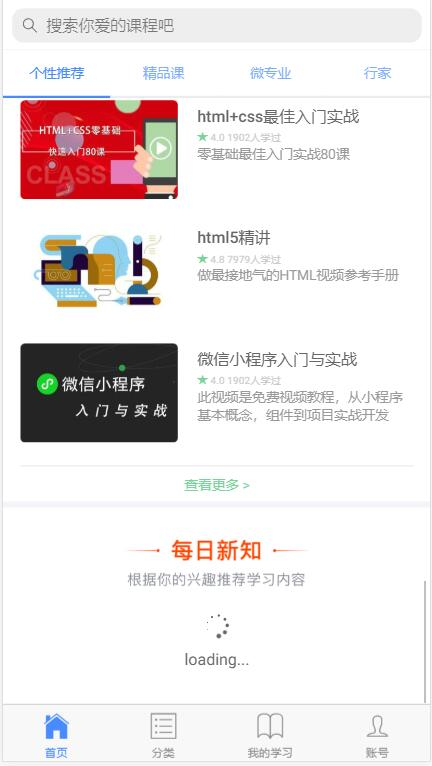
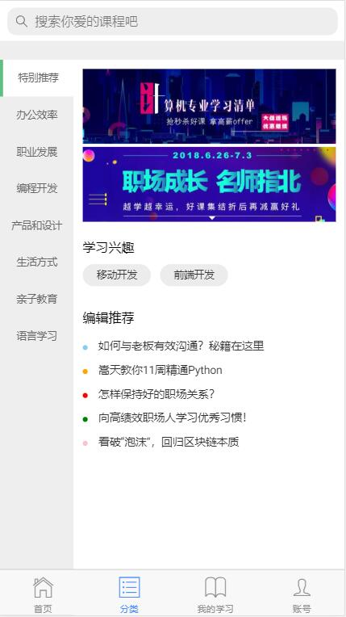
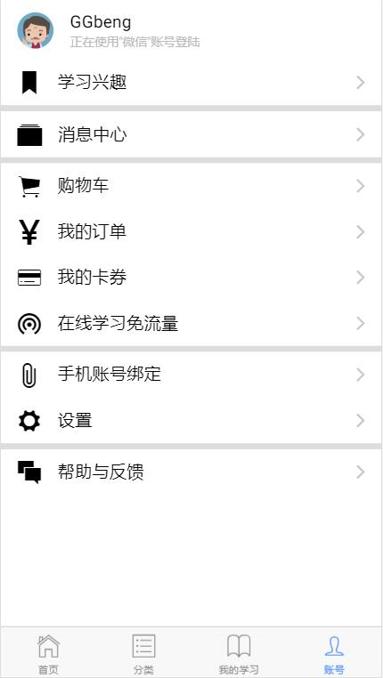

## 项目名称：
    在线课堂APP&H5混合开发1.0

## 技术架构：
	ionic v0.0.1 [内置angular v6.0 && sass]

## 目录结构：
	参考项目源码

## 项目展示：
<table>
    <tr>
        <td>项目负责人</td>
        <td colspan="4" style="text-align: center;">曹梦哲</td>
    </tr>
    <tr>
        <td>模块名称</td>
        <td>首页</td>
        <td>分类</td>
        <td>我的学习</td>
        <td>账号</td>
    </tr>
    <tr>
        <td>技术栈</td>
        <td>轮播图、左右滑动</td>
        <td>静态列表布局</td>
        <td>列表滚动加载</td>
        <td>多分支条件模板指令</td>
    </tr>
    <tr>
    	<td>效果图</td>
    	<td></td>
        <td></td>
    	<td></td>
        <td></td>
    	<td></td>
    </tr>
</table>

	
